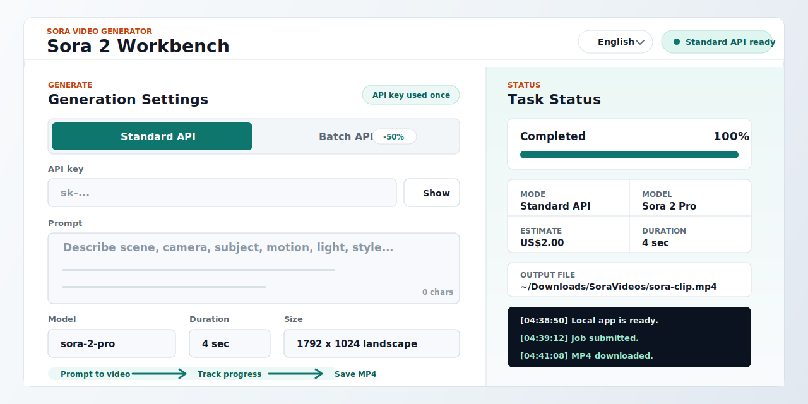

# Sora2App

Local web UI for generating videos with OpenAI Sora 2 / Sora 2 Pro. It runs on `127.0.0.1`, supports the standard Video API and Batch API, and saves completed MP4 files to a folder you choose.



[中文说明](./README.zh-CN.md)

## Why Use It

- Generate Sora 2 / Sora 2 Pro videos from a small local web app.
- Submit one prompt with the standard Video API, or split many prompts into a Batch API queue.
- Automatically poll jobs and download completed MP4 files.
- Choose model, duration, resolution, output folder, and filename from the UI.
- Keep the API key out of disk storage, browser localStorage, and logs.
- Use the built-in UI in Chinese, Japanese, English, or Korean.

## Privacy First

Sora2App is designed for local use:

- The server listens only on `127.0.0.1`.
- Your OpenAI API key is used only for the current request.
- The API key is not saved to files, browser localStorage, or application logs.
- The output folder is not persisted in browser localStorage.
- The UI shortens home-directory paths to `~/...` to reduce accidental path leaks in screenshots.
- Prompts, selected parameters, and generated videos are still sent to OpenAI when you submit a job.

When opening issues or sharing screenshots, remove API keys, video IDs, full local paths, private prompts, and generated files that you do not want to publish.

See [PRIVACY.md](./PRIVACY.md), [SECURITY.md](./SECURITY.md), and [CONTRIBUTING.md](./CONTRIBUTING.md) for public reporting guidelines.

## Quick Start

### Use the bundled macOS app folder

Double-click:

```text
Start Sora2App.command
```

Keep the whole `sora2app` folder together when moving it to another Mac. The bundled macOS runtime lives in `runtime/`.

### Run from source

Install Node.js 18 or newer, then run:

```bash
git clone https://github.com/swf-cmd/videogen.git
cd videogen
npm start
```

Open the local URL printed in the terminal:

```text
http://127.0.0.1:5177
```

## How It Works

1. Enter your OpenAI API key.
2. Choose standard API or Batch API.
3. Enter one prompt, or multiple prompts separated by blank lines for Batch mode.
4. Select `sora-2` or `sora-2-pro`.
5. Choose duration, resolution, output folder, and optional filename.
6. Submit the job and wait for the app to download the MP4 file.

Supported durations are `4`, `8`, `12`, `16`, and `20` seconds. The UI validates the model and resolution combinations before submitting requests.

## Batch Mode

Batch mode splits prompts by blank lines and submits them as a queue. If you enter one prompt, you can repeat it multiple times by setting the request count. If you enter multiple prompts, Sora2App submits the first N prompts from the queue.

The app includes a Batch price estimate based on its current built-in pricing table. Always check the current OpenAI pricing page before running large batches.

## Release Packaging

The source repository should not include the bundled `runtime/` folder because it is large. Keep `runtime/` out of git history and attach bundled app archives to GitHub Releases instead.

Suggested release assets:

- `sora2app-macos-universal.zip`: app folder with both arm64 and x64 Node runtimes.
- `source.zip`: source-only package without `runtime/`.
- Release notes with features, install steps, and known limitations.

## Recommended GitHub Metadata

Description:

```text
Local web UI for OpenAI Sora 2 / Sora 2 Pro video generation with Batch API and automatic MP4 downloads.
```

Topics:

```text
sora, sora-2, openai, openai-api, video-generation, ai-video, batch-api, nodejs, macos, local-first
```

For release steps and launch copy, see [docs/GITHUB_LAUNCH_CHECKLIST.md](./docs/GITHUB_LAUNCH_CHECKLIST.md) and [docs/PROMOTION_KIT.md](./docs/PROMOTION_KIT.md).

## Security Notes

Sora2App does not proxy requests through a third-party service. The local server calls OpenAI directly with the API key you enter in the browser.

Do not expose the local server to a public network. If you modify the server host, reverse proxy it, or deploy it remotely, you are responsible for securing access and protecting API keys.

## License

MIT
