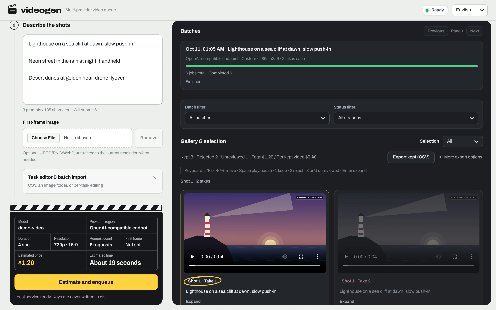
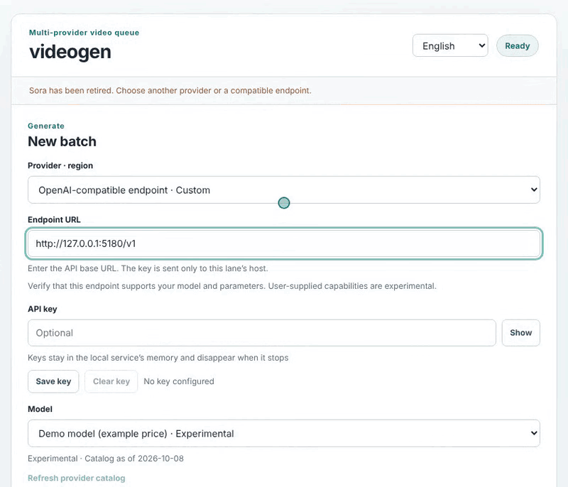
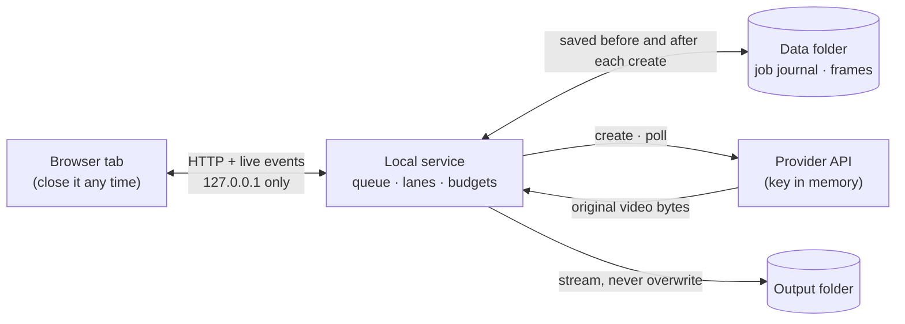

<div align="center">

# videogen

**Turn a prompt list or CSV into a reviewed batch of AI videos — on your own computer, with your own provider keys.**

[](https://github.com/swf-cmd/videogen/releases/latest)
[](https://github.com/swf-cmd/videogen/actions/workflows/portable.yml)
[](LICENSE)


**English** · [中文](README.zh-CN.md) · [日本語](README.ja.md) · [한국어](README.ko.md)

</div>

<picture>
  <source media="(prefers-color-scheme: dark)" srcset="docs/media/videogen-interface-dark.webp">
  
</picture>

<sub>Captured offline against a local stand-in endpoint. The clips are synthetic test animations, **not AI output**, and the $0.05/s price is an example catalog entry, not a provider quote. No paid API was called.</sub>

**[Download for Windows / macOS](https://github.com/swf-cmd/videogen/releases/latest)** · [Run from source](#quick-start) · [Watch a batch from start to finish](#a-batch-from-start-to-finish) · [Coming from Sora 2?](docs/MIGRATING_FROM_SORA.md)

> [!NOTE]
> **OpenAI shut down the Sora 2 API on 2026-09-24** ([deprecations](https://developers.openai.com/api/docs/deprecations)). videogen is the successor of Sora2App: the same local batch workflow, now on OpenRouter, Gemini, Alibaba Cloud Model Studio, Volcengine / BytePlus Ark or your own OpenAI-compatible server. Old Sora jobs cannot be moved automatically; the [migration guide](docs/MIGRATING_FROM_SORA.md) explains what to keep.

**New in 2.3 — slate and screening room.** The form is now four numbered steps, and a slate beside the submit button always shows the model, format, request count, first frame, estimated price and time that will be submitted. The render queue became a dark review pane with a first-run guide, folded lane settings, batch progress bars and circled keepers. Automatic dark mode, a pane switcher for narrow windows and reduced-motion support are included; features, settings and stored data are unchanged. See the [changelog](CHANGELOG.md).

## Why videogen

- **Batches, not one-offs.** Paste prompts separated by blank lines, or import a UTF-8 CSV with template variables plus a folder of images. Each row gets its own first frame (and last frame where the model supports it). **Takes per prompt** renders every row 1–20 times.
- **Pick the best take fast.** Finished videos land in a gallery grouped by shot and take. Review from the keyboard — **J/K** move, **Space** plays, **1** keeps, **2** rejects — then export the kept takes as CSV or JSON with paths, prompts, settings and SHA-256 for your editor.
- **See the cost before you submit.** Rows are checked against the model's capabilities and priced before anything is sent, and the slate shows the total next to the submit button. Set a batch budget and watch the estimated cost per kept clip. Missing prices stay **Unknown** instead of being guessed.
- **Built not to pay twice.** The queue lives in a local service: closing the browser changes nothing, and crashes or restarts resume known jobs. An interrupted create is never resent on its own — it waits for your decision. A 100-job crash test with SIGKILL restarts produced zero duplicate creates.
- **Local and private.** The service listens only on `127.0.0.1`. Keys stay in memory; prompts, frames and history stay in your data folder. No account, telemetry, update check or npm dependencies.
- **Many providers, one workflow.** The dated bundled catalog lists 31 video models across OpenRouter, Gemini, Model Studio and Ark — including Veo 3.1, Kling 3.0, Seedance 2.5, Wan 3.0 and Runway Gen-4.5 — plus any OpenAI-compatible server you run yourself. [Details](#providers-and-estimates)

## A batch from start to finish

[](docs/media/videogen-workflow.webm)

<sub>26 seconds, recorded with the same offline stand-in (synthetic clips, example price). [Full-size WebM](docs/media/videogen-workflow.webm).</sub>

## Quick start

**Portable ZIP — Windows x64 and macOS (Apple Silicon and Intel), nothing to install**

1. Download `videogen-<version>-windows-x64.zip` or `videogen-<version>-macos-universal.zip` from [Releases](https://github.com/swf-cmd/videogen/releases/latest) and extract the **whole** folder.
2. Double-click **Start videogen.cmd** (Windows) or **Start videogen.command** (macOS). Node 24 LTS is bundled. Your OS may ask you to confirm the first open; see [portable setup and checksums](docs/PORTABLE.md).
3. The app opens in your browser. Keep the terminal window open while jobs run. Records and default videos stay in `portable-data/` and `portable-output/` beside the launcher.

**From source — any OS with Node.js `^22.21.0 || >=24.5.0`** (22.21.0+ in the 22.x line, or 24.5.0+; Node 18, 20 and 23 are unsupported). No `npm install` is needed.

```bash
git clone https://github.com/swf-cmd/videogen.git
cd videogen
npm start
```

Open the printed address, normally `http://127.0.0.1:5177`. Choose a provider and model, save its API key, paste prompts or import a CSV, check the slate and choose **Estimate and enqueue**. Source runs save videos to `~/Downloads/videogen`.

<details>
<summary><b>Good to know before your first batch</b></summary>

- `PORT` changes the port; the service binds only to `127.0.0.1`. The launchers choose another local port when the default is busy.
- Ctrl+C allows up to 15 seconds to record in-flight work before exit. Only one service may use a data directory, even on different ports.
- Data and output folders must support hard links; use a local system disk instead of exFAT.
- Linux runs from source. Windows and Linux use a manually entered output directory.
- Keep the launcher, runtime and application files together. The former `Start Sora2App.command` name is retired.
- Opening `public/index.html` directly provides a preview without generation.

</details>

## The interface

The page has two panes: **New batch** on the left and the **Render queue** on the right. On wide screens each pane scrolls on its own; below 1,100 px they stack into one column with a **New batch · Render queue** switcher at the top. The interface follows your system's light or dark setting, turns off motion when you ask for reduced motion, and can be switched between English, Chinese, Japanese and Korean at any time.

| New batch step | What you set there |
| --- | --- |
| **1 · Model and key** | Provider · region, model, the lane's API key and endpoint. A compatible server also needs its model ID, capabilities and request format. |
| **2 · Describe the shots** | Prompts separated by blank lines and an optional shared first frame. **Task editor & batch import** opens CSV import, prompt templates, image-folder matching and per-row first/last frames. |
| **3 · Format and takes** | Duration, resolution, aspect ratio, **Takes per prompt** (1–20), and audio or seed when the model supports them. A single prompt can also be repeated. |
| **4 · Output and budget** | Output folder, file name prefix and an optional budget cap. Folded until you need it. |
| **Slate** | Model, provider, duration, resolution, request count, first frame, estimated price and time — always what **Estimate and enqueue** will submit. |

The **Render queue** shows a short guide until your first batch exists, then **Provider lanes** (status, key and concurrency, pause), **Batches** (a progress bar per batch, pause or cancel dispatch), **Gallery & selection** and the paginated **Jobs** table with every recovery action. Browser notifications for finished batches, review items and lanes waiting for a key are off until you switch them on.

| Gallery key | Action |
| --- | --- |
| **J** / **K** or **←** / **→** | Previous / next take |
| **Space** | Play or pause |
| **1** · **2** · **3** or **U** | Keep · Reject · back to Unreviewed (Keep and Reject jump to the next unreviewed take) |
| **Enter** | Expand the card |

Kept takes are circled in yellow and rejected takes are dimmed and struck through. Selection never deletes files.

## How it works


```mermaid
flowchart LR
  B["Browser tab<br/>(close it any time)"] <-->|"HTTP + live events<br/>127.0.0.1 only"| S["Local service<br/>queue · lanes · budgets"]
  S <-->|"saved before and after each create"| J[("Data folder<br/>job journal · frames")]
  S -->|"create · poll"| P["Provider API<br/>(key in memory)"]
  P -->|"original video bytes"| S
  S -->|"stream, never overwrite"| O[("Output folder")]
```

Each provider + region + base URL is a **lane** with its own key, concurrency and pause state. A job is recorded on disk before its create request is sent, and its remote ID is saved before anything else happens, so a restart resumes polling and downloading instead of creating again. If the outcome of a create is unknown, the job stops at **Needs review**. See [Architecture](docs/ARCHITECTURE.md) for the state machine and invariants.

## Batch details

See the [CSV columns, templates and folder-matching guide](docs/BATCH_IMPORT.md) for copyable examples.

1. **Model and key.** Select **provider · region** and a model. For a compatible server, enter its base URL, model ID and documented capabilities, and choose JSON or multipart before submission; the app never retries a create with another request format. Enter and save the lane's key. A lane is provider + region + base URL. Keys stay in service memory; changing lane or URL clears the input. A local endpoint may allow an empty key, and you may queue work before supplying a required key.
2. **Describe the shots.** Separate prompts with blank lines, repeat a single prompt, or import a UTF-8 CSV/template and image folder. Give each row its own first frame and, when supported, last frame. Row validation checks the selected model before submission; templates expand variables into prompts.
3. **Format and takes.** Duration, resolution and aspect ratio list only what the selected model supports; audio and seed appear only when it supports them. Set **Takes per prompt** (1–20) to render every prompt or row several times for comparison; files get `-t1`, `-t2`… suffixes.
4. **Output and budget.** Choose the output directory and file name prefix, and optionally a batch budget.
5. **Estimate and enqueue.** The confirmation repeats the estimated cost, ETA and prompts × takes before anything is sent. Missing prices show **Unknown**. Currency totals remain separate; estimates are not provider billing guarantees.
6. **Review and export.** Preview completed videos in the gallery, grouped by shot and take, and review them from the keyboard. Inspect the estimated cost per kept clip and **Export kept (CSV)**: a manifest with absolute output paths, prompts, models, settings, shot/take, costs and SHA-256 for your editor or team (JSON and all-takes variants are under **More export options**). Every regeneration requires a fresh explicit confirmation and can incur a new charge; a regeneration the batch budget cannot cover is refused.

Default render concurrency is 1 for compatible endpoints, 2 for OpenRouter and Model Studio, and 3 for Gemini and Ark. You can adjust each lane. A separate pool downloads up to 3 results at once.

Source outputs default to `~/Downloads/videogen`; portable bundles use `portable-output/`. `VIDEOGEN_OUTPUT_DIR` overrides the default. Downloads stream to disk, preserve provider bytes and metadata, and never replace an existing file. A collision gets another filename. Results nearing expiry are highlighted; keep the service running to save them promptly.

A budget limits **estimated future dispatch**, not your provider's bill. It accounts for reserved and possibly charged work; already submitted jobs continue. Unknown pricing cannot be used for a budget. Gemini's estimate covers video output only and excludes additional input/thinking charges. Pausing a lane or batch stops new creates while submitted work remains tracked. Cancelling stops queued jobs; current production adapters continue tracking and downloading already submitted work, which may already be charged.

## Restart and review

The browser receives incremental Server-Sent Events (SSE). Closing or refreshing the tab does not stop the service queue. After restarting the service, re-enter each required lane key; known remote jobs resume polling/download, and queued jobs can continue. Lane concurrency and manual pause settings persist.

An interrupted or ambiguous create becomes **Needs review** (`needs_review`). The app does not automatically create it again. Inspect the provider console, choose **Resolve** on the job, then pick one action:

- **Link an existing remote job.** Enter the provider's task ID to resume polling/download without a new create.
- **I confirmed no job was created → resubmit.** This explicitly authorizes another create and can duplicate a charge if your conclusion is wrong.
- **Stop tracking.** Stop local tracking of that review item; this does not cancel or refund work at the provider.

A running or downloading job can also be **stopped tracking** at any time — for example after attaching a mistyped ID or deleting the task at the provider. This frees its lane slot; it does not cancel or refund remote work. If the provider answers only 404/410 for a running task for 15 minutes without interruption, the job fails with `remote_not_found` and keeps its remote ID for manual checks. Other poll and download 4xx responses on accepted work, including an empty balance, are retried with backoff instead of discarding a paid render.

A failed job can be retried only when the app has evidence that create was not accepted. A timeout, connection reset, malformed response or create 5xx is not such evidence. Rate limits cool the lane; authentication waits for a replacement key; balance/model-access problems pause new submissions while accepted jobs keep polling and downloading. Moderation failures affect only their own jobs.

**Gemini uses background interactions.** The create request sets `background: true`; the interaction ID is saved before polling. A restart resumes that ID after key re-entry, and successful results retain their Files address. A create response lost before the ID is received can still require review; background mode cannot guarantee recovery across every network failure. Existing Files references remain usable for manual recovery. See the [Gemini contract](docs/providers/gemini.md).

## Providers and estimates

Catalog/source date: **2026-10-08**; provider facts rechecked **2026-10-11**, when OpenRouter's live list still matched the bundled snapshot model for model. All adapters have offline contract tests. No paid provider calls were made for this release; account access and live behavior still need confirmation with your provider.

| Provider · region | Included models and limitations |
| --- | --- |
| OpenRouter · global | The dated fallback snapshot lists 26 video models, including Google Veo 3.1 (standard, Fast, Lite), Kling 3.0, ByteDance Seedance 2.5, Alibaba Wan 3.0, Runway Gen-4.5, MiniMax H3, Grok Imagine Video and FLUX.3 Video. Explicit refresh fetches the current video catalog. Models that do not declare durations, resolutions and aspect ratios are not listed, because controls and estimates are built from them; today that leaves out OpenRouter's video-editing, upscaling and talking-avatar models. Local first frames use base64 data URLs in `frame_images` when the refreshed model advertises support. Controls, validation and estimates follow `/videos/models`; unavailable capabilities are not assumed. USD SKU estimates; ByteDance token prices use OpenRouter's published formula (height × width × seconds × 24 / 1024), while undocumented sizes such as 4K stay unknown. Retention and account limits remain unknown. Requests carry OpenRouter app-attribution headers (`VIDEOGEN_OPENROUTER_ATTRIBUTION=0` disables them). [Contract](docs/providers/openrouter.md) |
| Gemini API · supported regions | `gemini-omni-1.1-flash`, 3–10 seconds, 360p/720p/1080p/4K, first/last frames and native audio. Audio is fixed on; seed is unavailable. Only the 720p video-output token factor is verified: about USD 0.10136/second, plus input/thinking charges. Other resolution estimates are unknown. Google lists 2026-10-22 as the earliest shutdown date for the Veo 3.1 preview models in the Gemini API and names `gemini-omni-1.1-flash` as their replacement; Veo remains available through OpenRouter. [Contract](docs/providers/gemini.md) |
| Alibaba Cloud Model Studio · Beijing / Singapore | `wan3.0-video`, `wan3.0-video-prime` (labelled preview in Alibaba's API reference), 2–30 seconds, 480p/720p/1080p, supported first/last frames, audio toggle and seed. Enter your **workspace-specific hostname**; placeholders, generic legacy hosts and region mismatches are rejected. Bundled estimates use the CNY list prices, which differ by region; no promotional discount is assumed. Singapore accounts on the international site are billed in USD and can override the prices in `catalog.local.json`. [Contract](docs/providers/dashscope.md) |
| Volcengine Ark · Beijing / BytePlus ModelArk · overseas | Seedance 2.5: `doubao-seedance-2-5-260628` / `dreamina-seedance-2-5-260628`, 4–30 seconds, 480p/720p/1080p, first/last frames and audio toggle. No seed: ByteDance's API reference lists `seed` only for older Seedance models. CN pricing is unknown; BytePlus uses a verified USD token/dimension formula. Adaptive output dimensions have unknown cost. 1080p HEVC may not play in every browser. [Contract](docs/providers/ark.md) |
| OpenAI-compatible · custom | Configure a local or trusted server's exact model/capabilities (for example an SGLang or vLLM-Omni video server); experimental by default. Choose its supported request format. No default Sora model or assumed price. [Contract](docs/providers/openai-compatible.md) |
| Mock · local | Development only with `VIDEOGEN_DEV=1`; deterministic test bytes, not playable generated videos. |

`data/catalog/` contains the bundled catalog. `catalog.local.json` in the data directory can override it. OpenRouter refresh results are cached; failures retain a usable catalog, with the bundled snapshot as fallback. Unknown/unverified configurations are marked **Experimental**. Provider prices and access can change.

For Wan 3, replace the placeholder with your actual workspace ID:

- Beijing: `https://<WorkspaceId>.cn-beijing.maas.aliyuncs.com`
- Singapore: `https://<WorkspaceId>.ap-southeast-1.maas.aliyuncs.com`

## Regions and account terms

Provider terms, region eligibility and billing apply independently of this project's MIT license. Checked **2026-10-11**; the linked provider notes distinguish verified facts from unresolved details.

| Provider · region | Requirements and restrictions |
| --- | --- |
| OpenRouter · global | Availability depends on the account and underlying provider. Video generation needs temporary retention and is not eligible for zero data retention. [Video guide](https://openrouter.ai/docs/guides/overview/multimodal/video-generation) |
| Compatible endpoint · custom | Follow the selected server/model's license, allowed use and account rules. Use HTTPS for remote endpoints. |
| Gemini API · supported regions | Mainland China is absent from the [available-region list](https://ai.google.dev/gemini-api/docs/available-regions). Users must be 18+; the API is for professional/business development. API clients available in the EEA, UK or Switzerland must use paid services. [Terms](https://ai.google.dev/gemini-api/terms) |
| Gemini Omni · EEA / UK / Switzerland | Editing/extending uploaded videos and uploading/editing minors' images are restricted. This app supports first-frame images, not uploaded-video editing; a proxy does not change region eligibility. [Omni limitations](https://ai.google.dev/gemini-api/docs/omni) |
| Model Studio · Beijing / Singapore | Match workspace, region and key. Activation may ask for real-name verification and needs a nonnegative balance; billable use needs sufficient funds, and free-quota conditions can differ. [FAQ](https://help.aliyun.com/zh/model-studio/faq-about-alibaba-cloud-model-studio), [quota rules](https://help.aliyun.com/zh/model-studio/new-free-quota), [regions](https://help.aliyun.com/zh/model-studio/regions) |
| Volcengine Ark · Beijing | Complete applicable real-name onboarding; confirm the current console requirements. Seedance activation accepts a balance above CNY 200, a qualifying savings plan, or remaining resource-pack quota. The detailed onboarding source remains incompletely verified. [Contract and confidence](docs/providers/ark.md), [activation requirements](https://docs.volcengine.com/docs/ark/create-video-generation-task-api?lang=zh) |
| BytePlus ModelArk · overseas | The general service list excludes the US and includes Canada, UK, Australia and New Zealand; restricted models have separate rules and purchase eligibility governs. Activation lists a balance above USD 30, a qualifying savings plan, or remaining resource-pack quota. Portrait inputs have provider authorization rules. [Availability](https://docs.byteplus.com/en/docs/ModelArk/availability), [provider details](docs/providers/ark.md) |

## Proxy configuration

`npm start` and the launcher enable Node's native environment-proxy support. For an account legally eligible to use the selected service, this shell example routes Gemini/OpenRouter through a local proxy and bypasses it for Model Studio/Volcengine hosts:

```bash
export HTTPS_PROXY=http://127.0.0.1:7890
export HTTP_PROXY=http://127.0.0.1:7890
export NO_PROXY=.aliyuncs.com,.volces.com
npm start
```

On PowerShell, set the same names with `$env:HTTPS_PROXY`, `$env:HTTP_PROXY` and `$env:NO_PROXY` before `npm start`. With no proxy variables, requests go directly. Nonempty lowercase `https_proxy`, `http_proxy` and `no_proxy` values take precedence over uppercase names; clear stale lowercase values if your configuration seems ignored. The app always adds loopback hosts to the bypass list, so local endpoints never use a proxy. The UI shows the effective proxy address with credentials redacted. Invalid proxy configuration stops startup without echoing the raw URL. There is no per-lane proxy setting. For direct Node invocation, use `node --no-use-env-proxy server.js`. The initial process safely validates and normalizes proxy settings, then starts the service with native proxy support enabled; the negative flag protects the validation step.

## Privacy and local files

**Prompts, parameters, reference images, gallery selections, remote IDs, job/batch states, cost estimates and output paths persist on disk.** Keys stay in memory and disappear when the service stops.

| System | Default data directory |
| --- | --- |
| macOS | `~/Library/Application Support/videogen/` |
| Linux | `${XDG_DATA_HOME:-~/.local/share}/videogen/` |
| Windows | `%APPDATA%\videogen\` |

Portable bundles instead use `portable-data/` beside the launcher. `VIDEOGEN_DATA_DIR` overrides the location. Files include `jobs.ndjson`, `jobs.snapshot.ndjson`, `assets/`, nonsecret lane `settings.json`, optional `catalog.local.json`, OpenRouter's catalog cache and the instance lock. Directories/files use 0700/0600 where supported; they are not encrypted by the app.

**Clear history and assets** removes finished records and unused images. Unfinished and `needs_review` items remain, as do downloaded videos; delete videos separately. It does not delete provider data or backups. Nonsecret `videogen.*` browser preferences persist; API keys and output-directory preferences do not. Job records still contain their output paths.

Prompts/images go to the chosen provider; downloads may contact its returned storage/CDN URLs. OpenRouter requests include app-attribution headers naming videogen (no user data) so the project appears in OpenRouter's public app rankings; set `VIDEOGEN_OPENROUTER_ATTRIBUTION=0` to omit them. An exported manifest contains absolute local paths, prompts and remote IDs; share it accordingly. Presigned downloads omit API credentials; authenticated downloads start on the lane origin and redirects strip credentials. Proxy URL userinfo and known keys are redacted from errors. There is no telemetry, update check or project-operated cloud service. [Privacy details](PRIVACY.md) · [Security policy](SECURITY.md) · [Architecture](docs/ARCHITECTURE.md)

## FAQ

**Is videogen a video model?** No. It is a local client and queue: it sends your prompts and frames to the provider you choose, tracks the jobs and saves the results. Output quality, content rules, availability and prices are the provider's.

**What does it cost?** videogen itself is free and MIT-licensed. Each accepted provider job can be billed by that provider; the slate and confirmation show an estimate first. A self-hosted OpenAI-compatible server has no provider bill but needs hardware that can run the model.

**Can I open it from my phone or another computer?** Not directly. The service listens only on `127.0.0.1`, so other devices on your network cannot reach it. The narrow layout is for small browser windows on the same computer.

**What if I close the browser or restart?** Closing the tab changes nothing; the service keeps working. If the service itself stops, start it again and re-enter your keys: known jobs resume and nothing is created twice without your confirmation.

**Can I bring my old Sora jobs?** The Sora 2 API no longer exists, so old remote jobs cannot be resumed. Keep your downloaded videos and prompts and follow the [migration guide](docs/MIGRATING_FROM_SORA.md).

## Development and acceptance

```bash
npm test
npm run test:e2e
VIDEOGEN_DEV=1 npm start
```

Tests use Node's built-in runner, local mock providers and temporary directories. They run offline and make no paid API calls. The 100-job crash acceptance run used two lanes, three SIGKILL restarts and five SSE disconnects: 92 succeeded, 5 moderation failures and 3 review items; zero duplicate creates, untracked remote jobs, hash mismatches or exposed keys. Observed lane maxima were 3/5 and the download pool maximum was 3. These are mock-test results, not a provider uptime or billing guarantee. CI runs the same suites on Linux and Windows with Node 22.21.0 and 24.21.0, and smoke-tests the portable bundles on Windows x64, Apple Silicon and Intel Macs.

The app uses CommonJS and classic browser scripts. Legacy generation/status/download routes are removed; the UI uses persistent batch/job APIs and `/api/events`. See [Contributing](CONTRIBUTING.md), [Changelog](CHANGELOG.md) and the [release checklist](docs/GITHUB_LAUNCH_CHECKLIST.md).

For records damaged by older short-key redaction, see [offline quarantine recovery](docs/DATA_RECOVERY.md).

## License

[MIT](LICENSE). Provider terms and billing apply separately. Keep `runtime/`, generated media, local task data and credentials out of source control.
