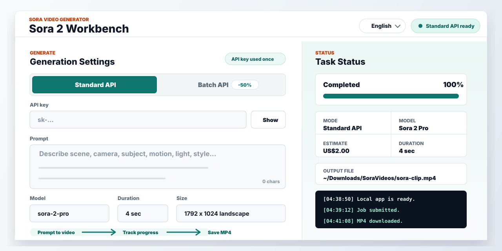

# Sora2App

**A local-first workbench for OpenAI Sora 2 / Sora 2 Pro.**  
Generate videos from your browser, queue prompts with Batch API, and auto-download finished MP4s — without shipping your API key to disk, localStorage, or logs.

[中文说明](./README.zh-CN.md)

<p align="center">
  
</p>

<p align="center">
  <a href="#quick-start"></a>
  <a href="#privacy--security"></a>
  <a href="https://github.com/swf-cmd/videogen/blob/main/LICENSE"></a>
  
  
</p>

---

## Why Sora2App

OpenAI’s video APIs are powerful; the missing piece is a calm local UI for day-to-day work — prompt iteration, batch queues, status watching, and file hygiene — without a third-party proxy.

| | |
|---|---|
| **Standard + Batch** | One-shot Video API, or multi-prompt Batch queues with built-in price estimate |
| **Hands-off downloads** | Auto-poll jobs and save completed MP4s to a folder you choose |
| **First-frame control** | Optional JPEG / PNG / WebP reference, auto-fitted to the selected resolution |
| **Local-only server** | Listens on `127.0.0.1` only — no external control plane |
| **Key stays ephemeral** | API key is never written to disk, localStorage, or app logs |
| **Multilingual UI** | Chinese · Japanese · English · Korean |

---

## Quick Start

### Option A — macOS app folder

If you have the bundled package (from [Releases](https://github.com/swf-cmd/videogen/releases)):

```text
Start Sora2App.command
```

Keep the entire app folder together when moving it. Bundled Node runtimes live under `runtime/`.

### Option B — run from source

Requires **Node.js 18+**.

```bash
git clone https://github.com/swf-cmd/videogen.git
cd videogen
npm start
```

Open the URL printed in the terminal (default):

```text
http://127.0.0.1:5177
```

> No extra dependencies to install — `npm start` runs `node server.js` directly.

---

## How to use

1. Paste your **OpenAI API key**
2. Pick **Standard API** or **Batch API**
3. Enter a prompt — or several prompts separated by blank lines (Batch)
4. Choose **`sora-2`** or **`sora-2-pro`**
5. Set duration, resolution, optional first-frame image, output folder, and filename
6. Submit — the app polls status and downloads the MP4 when ready

### Models & constraints

| | Details |
|---|---|
| **Duration** | `4` · `8` · `12` · `16` · `20` seconds |
| **sora-2** | `720×1280` · `1280×720` |
| **sora-2-pro** | `720×1280` · `1280×720` · `1024×1792` · `1792×1024` · `1080×1920` · `1920×1080` |
| **First frame** | Optional JPEG / PNG / WebP; resized to the current resolution when needed |

The UI validates model ↔ resolution pairs before anything is submitted.

### Batch mode

- Prompts are split on **blank lines** into a queue
- **One prompt** → set request count to repeat it
- **Many prompts** → submit the first *N* items from the queue (up to 50,000)
- Batch pricing shows an in-app estimate with the ~50% Batch discount; always confirm against [OpenAI pricing](https://openai.com/api/pricing/) before large runs

---

## Privacy & security

Sora2App is built for **local use**, not multi-tenant hosting.

| Guarantee | Behavior |
|---|---|
| Bind address | Server listens on **`127.0.0.1` only** |
| API key | Used for the current request only — **not** stored on disk, in localStorage, or in logs |
| Output path | Folder choice is **not** persisted in localStorage |
| Path display | Home paths are shortened to `~/...` to reduce screenshot leaks |
| Network path | Local server calls OpenAI **directly** — no third-party proxy |

Still true: prompts, parameters, optional reference images, and generated videos are sent to OpenAI when you submit a job. Do not paste secrets you would not send to OpenAI.

When filing issues or sharing screenshots, strip API keys, full local paths, video / Batch IDs, private prompts, and any video you do not want public.

Full notes: [PRIVACY.md](./PRIVACY.md) · [SECURITY.md](./SECURITY.md) · [CONTRIBUTING.md](./CONTRIBUTING.md)

**Do not expose this server to a public network.** If you change the host, reverse-proxy it, or deploy remotely, you own access control and key protection.

---

## Project layout

```text
videogen/
├── server.js              # Local Node server (OpenAI + file I/O)
├── public/                # Web UI
├── Start Sora2App.command # macOS launcher (bundled package)
├── docs/                  # Previews & launch notes
└── runtime/               # Bundled Node (release packages only; not in git)
```

---

## Releases

The git repository **does not** ship `runtime/` (too large for source history). Put full macOS bundles on [GitHub Releases](https://github.com/swf-cmd/videogen/releases) instead.

Suggested assets:

| Asset | Contents |
|---|---|
| `sora2app-macos-universal.zip` | App folder + arm64 / x64 Node runtimes |
| `source.zip` | Source only, no `runtime/` |

Launch checklist & copy: [docs/GITHUB_LAUNCH_CHECKLIST.md](./docs/GITHUB_LAUNCH_CHECKLIST.md) · [docs/PROMOTION_KIT.md](./docs/PROMOTION_KIT.md)

---

## Contributing

Issues and PRs are welcome. Please search existing issues first, and never paste API keys or private media into tickets.

See [CONTRIBUTING.md](./CONTRIBUTING.md) for setup and PR guidelines.

---

## License

[MIT](./LICENSE) — free to use, modify, and ship.
