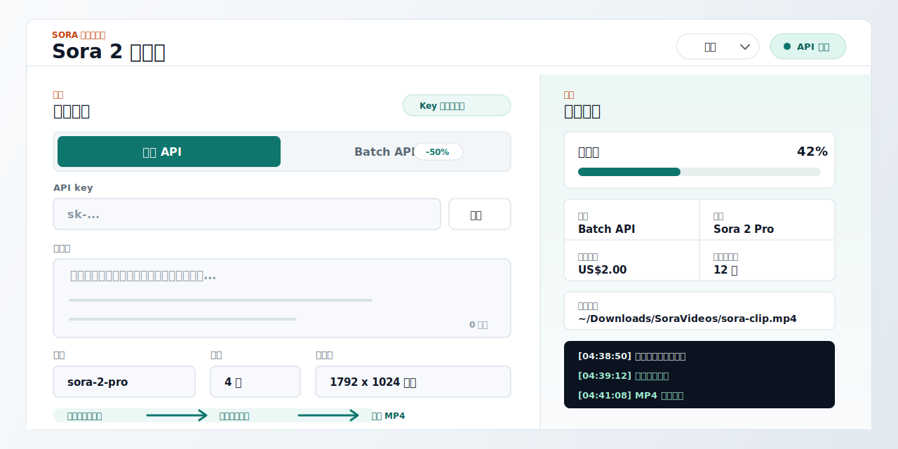

# Sora2App

Sora2App 是一个本地运行的小网页，用来调用 OpenAI Sora 2 / Sora 2 Pro 生成视频。它只监听 `127.0.0.1`，支持标准 Video API 和 Batch API，并会把完成后的 MP4 保存到你选择的输出目录。



[English README](./README.md)

## 适合谁

- 想用本地网页快速生成 Sora 2 / Sora 2 Pro 视频的人。
- 想批量测试提示词、对比不同参数的人。
- 想自动轮询任务、自动下载 MP4，而不是手动查状态的人。
- 想尽量减少 API key 和本机路径泄露风险的人。

## 功能亮点

- 支持标准 Video API 和 Batch API。
- 支持 `sora-2` 与 `sora-2-pro` 的时长、分辨率组合校验。
- Batch 模式可把提示词按空行拆成任务队列，并自动下载完成的视频。
- API key 不会写入磁盘、localStorage 或日志。
- 输出目录不会持久化到 localStorage。
- 界面展示本机主目录下的路径时会缩写成 `~/...`，减少截图泄露完整用户名或路径的风险。
- 界面内置中文、日文、英文、韩文。

## 快速开始

### 使用 macOS 打包版本

直接双击：

```text
Start Sora2App.command
```

这个文件夹可以包含 macOS arm64 和 x64 的 Node.js 运行时。复制到其他 Mac 或其他路径时，请复制整个 `sora2app` 文件夹，尤其不要漏掉 `runtime/` 文件夹。启动器会从自己所在目录寻找文件，并在默认端口被占用时自动尝试后续可用端口。

### 从源码运行

如果机器上已经安装 Node.js 18 或更新版本，也可以运行：

```bash
git clone https://github.com/swf-cmd/videogen.git
cd videogen
npm start
```

打开终端显示的地址，默认是：

```text
http://127.0.0.1:5177
```

## 使用方式

页面里填入：

- OpenAI API key
- 调用方式：`标准 API` 或 `Batch API`
- 提示词
- 模型：`sora-2` 或 `sora-2-pro`
- 时长：`4`、`8`、`12`、`16`、`20` 秒
- 分辨率：
  - `sora-2`：`720x1280`、`1280x720`
  - `sora-2-pro`：`720x1280`、`1280x720`、`1024x1792`、`1792x1024`、`1080x1920`、`1920x1080`
- 输出目录和文件名

Batch API 模式会把提示词按空行拆成多条任务，并可在界面里选择本次提交条数。未手动修改条数时，提交条数会跟随提示词队列数量；单条提示词可以选择重复提交多条任务，多条提示词则会提交队列前 N 条。

界面会显示 Batch 价格估算。大批量生成前，请以 OpenAI 当前官方价格页面为准。

## 隐私与安全

- 本应用只监听 `127.0.0.1`，默认不对局域网或公网开放。
- API key 只在本机浏览器和本机服务之间传递，用于向 OpenAI 发起本次请求。
- API key 不会保存到本地文件、localStorage 或日志中。
- 输出目录不会保存到 localStorage。
- 提示词、参数和生成请求会发送给 OpenAI；不要提交你不希望发送给 OpenAI 的内容。
- 发 issue、发帖或发截图前，请遮掉 API key、完整本机路径、video id、私密提示词和不想公开的视频内容。

更多公开报告规则见 [PRIVACY.md](./PRIVACY.md)、[SECURITY.md](./SECURITY.md) 和 [CONTRIBUTING.md](./CONTRIBUTING.md)。

## 开源仓库发布建议

源码仓库不应该包含 `runtime/` 目录，因为它体积较大，也不适合放入 git 历史。建议：

- 源码仓库保留 `server.js`、`public/`、README、LICENSE 等。
- `runtime/` 放进 GitHub Release 附件里的 macOS 打包 zip。
- Release 里同时提供源码包和完整可运行包。

推荐 GitHub About：

```text
Local web UI for OpenAI Sora 2 / Sora 2 Pro video generation with Batch API and automatic MP4 downloads.
```

推荐 topics：

```text
sora, sora-2, openai, openai-api, video-generation, ai-video, batch-api, nodejs, macos, local-first
```

发布步骤和推广文案见 [docs/GITHUB_LAUNCH_CHECKLIST.md](./docs/GITHUB_LAUNCH_CHECKLIST.md) 与 [docs/PROMOTION_KIT.md](./docs/PROMOTION_KIT.md)。

## License

MIT
