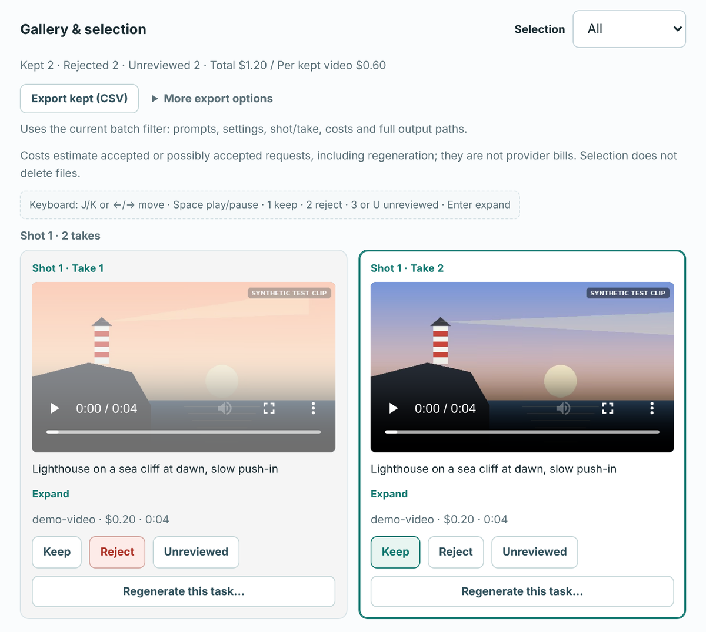
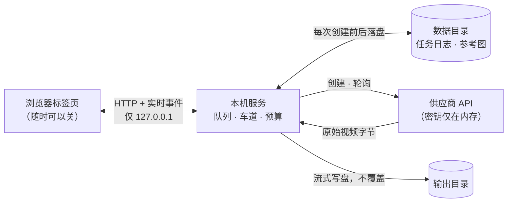

<div align="center">

# videogen

**把提示词列表或 CSV 变成一批挑好片的 AI 视频——在你自己的电脑上，用你自己的供应商密钥。**

[](https://github.com/swf-cmd/videogen/releases/latest)
[](https://github.com/swf-cmd/videogen/actions/workflows/portable.yml)
[](LICENSE)


[English](README.md) · **中文** · [日本語](README.ja.md) · [한국어](README.ko.md)

</div>

[](docs/media/videogen-workflow.webm)

<sub>录屏在本机离线完成，连接的是本地模拟端点。画面中的视频是程序绘制的测试动画，**不是 AI 生成结果**；每秒 $0.05 的价格来自本地示例目录，不是供应商报价。全程没有调用付费接口。</sub>

**[下载 Windows / macOS 免安装包](https://github.com/swf-cmd/videogen/releases/latest)** · [从源码运行](#快速开始) · [原尺寸录屏](docs/media/videogen-workflow.webm) · [从 Sora 2 迁移](docs/MIGRATING_FROM_SORA.zh-CN.md)

> [!NOTE]
> **OpenAI 已于 2026-09-24 关停 Sora 2 API**（[弃用公告](https://developers.openai.com/api/docs/deprecations)）。videogen 是 Sora2App 的后继版本：保留同样的本机批量工作流，改为接入 OpenRouter、Gemini、阿里云百炼、火山方舟 / BytePlus ModelArk，或你自己的 OpenAI 兼容服务器。旧的 Sora 任务无法自动迁移，需要保留哪些内容见[迁移说明](docs/MIGRATING_FROM_SORA.zh-CN.md)。

**2.2.0 新增：**每条提示词生成多个 take、按镜头分组的键盘审片、可导入剪辑软件的保留片清单（CSV/JSON）、对卡住的远端任务“停止跟踪”、可选桌面通知和手机布局。同时修复了重新输入密钥导致服务卡死、取消／预算／暂停边界情况下可能派发不需要的付费创建，以及慢速网络下下载失败等问题。详见[更新日志](CHANGELOG.md)。

## 为什么用 videogen

- **批量，而不是一条条点。** 用空行分隔粘贴多条提示词，或导入带模板变量的 UTF-8 CSV 和图片文件夹。每一行都能单独设置首帧（模型支持时还有尾帧），**每条生成次数**可让每行渲染 1–20 次。
- **快速挑出最好的一条。** 完成的视频按镜头和 take 分组进入画廊。全程键盘操作——**J/K** 切换、**空格**播放、**1** 保留、**2** 淘汰——再把保留片导出为 CSV 或 JSON（含路径、提示词、参数和 SHA-256），直接交给剪辑软件。
- **提交前先看费用。** 每一行都会先按模型能力校验并估价，什么都不会提前发出。可设置批次预算，查看每条保留片的估算成本。缺少价格时显示**未知**，不会瞎猜。
- **设计上避免重复扣费。** 队列由本机服务持有：关掉浏览器没有影响，崩溃或重启后继续跟踪已知任务。创建请求被打断时绝不会自动重发，而是等你决定。100 个任务、多次 SIGKILL 重启的崩溃测试中，重复创建为 0。
- **本机运行，保护隐私。** 服务只监听 `127.0.0.1`。密钥只在内存中，提示词、参考图和任务记录留在你的数据目录。无需注册账号，没有遥测、更新检查，也没有 npm 依赖。
- **多家供应商，一套流程。** 带日期的内置目录收录 OpenRouter、Gemini、百炼和方舟的 31 个视频模型，包括 Veo 3.1、可灵 3.0、Seedance 2.5、万相 3.0、Runway Gen-4.5，另可接入你自己运行的 OpenAI 兼容服务器。[详情](#供应商与估算)

<p align="center"></p>
<p align="center"><sub>同一次离线运行中的审片画廊（测试动画，示例价格）。</sub></p>

## 快速开始

**免安装 ZIP：Windows x64 与 macOS（Apple Silicon 和 Intel），无需安装任何东西**

1. 从 [Releases](https://github.com/swf-cmd/videogen/releases/latest) 下载 `videogen-<版本>-windows-x64.zip` 或 `videogen-<版本>-macos-universal.zip`，**完整**解压整个文件夹。
2. 双击 **Start videogen.cmd**（Windows）或 **Start videogen.command**（macOS）。已内置 Node 24 LTS。系统首次打开可能要求确认，详见[整合包说明及校验](docs/PORTABLE.md)。
3. 浏览器会自动打开应用。任务运行期间请保持终端窗口打开。任务数据与默认输出分别放在启动器旁边的 `portable-data/`、`portable-output/`。

**从源码运行：任意系统，Node.js `^22.21.0 || >=24.5.0`**（22.x 需 22.21.0 及以上，或 24.5.0 及以上；不支持 Node 18、20、23）。无需执行 `npm install`。

```bash
git clone https://github.com/swf-cmd/videogen.git
cd videogen
npm start
```

打开服务打印的地址，默认 `http://127.0.0.1:5177`。选择供应商和模型、保存密钥、粘贴提示词或导入 CSV，确认估价后提交。从源码运行时视频默认保存到 `~/Downloads/videogen`。

<details>
<summary><b>第一次提交前值得知道的事</b></summary>

- 可用 `PORT` 更换端口；服务始终只监听 `127.0.0.1`。默认端口被占用时，启动器自动选择其他本地端口。
- 按 Ctrl+C 后最多等待 15 秒，让正在进行的请求完成持久化再退出。即使使用不同端口，同一个数据目录也只允许一个服务实例。
- 数据和输出目录须支持硬链接；请使用本地系统磁盘，勿使用 exFAT。
- Linux 从源码运行；Windows 和 Linux 手动填写输出目录。
- 保持启动器、运行时和应用文件完整。旧名 `Start Sora2App.command` 已废弃。
- 直接打开 `public/index.html` 可预览界面，但不能生成。

</details>

## 工作原理


```mermaid
flowchart LR
  B["浏览器标签页<br/>（随时可以关）"] <-->|"HTTP + 实时事件<br/>仅 127.0.0.1"| S["本机服务<br/>队列 · 车道 · 预算"]
  S <-->|"每次创建前后落盘"| J[("数据目录<br/>任务日志 · 参考图")]
  S -->|"创建 · 轮询"| P["供应商 API<br/>（密钥仅在内存）"]
  P -->|"原始视频字节"| S
  S -->|"流式写盘，不覆盖"| O[("输出目录")]
```

供应商 + 区域 + base URL 构成一条**车道**，各自拥有密钥、并发和暂停状态。任务在发出创建请求之前先写入磁盘，拿到远端 ID 后立即保存，因此重启后会继续轮询和下载，而不是再创建一次。创建结果不明时，任务停在**待核实**。状态机与不变式见[架构说明](docs/ARCHITECTURE.md)。

## 提交批次

[CSV 列名、模板变量和图片匹配说明](docs/BATCH_IMPORT.md)提供可复制示例。

1. 选择**供应商 · 区域**及模型。兼容服务器需填写 base URL、模型 ID 和已核实的能力。提交前选定 JSON 或 multipart；应用不会换一种格式重发创建请求。
2. 输入并保存该车道的密钥。车道由供应商、区域和 base URL 共同确定。密钥只保存在服务内存；切换车道或 URL 会清空输入框。本地端点可以不要求密钥，也可以先排队、稍后再输入所需密钥。
3. 用空行分隔多条提示词、重复单条提示词，或导入 UTF-8 CSV／模板变量和图片文件夹。每条任务可单独设置首帧、按模型能力设置尾帧；提交前逐行校验并估价。设置**每条生成次数**（1–20）可把每条提示词或每行渲染多次以便比较，文件名带 `-t1`、`-t2`… 后缀。选择输出目录和文件名。
4. 查看成本与 ETA，可选填批次预算，再确认提交。缺少价格时显示**未知**；不同币种分别显示，估算不是供应商账单承诺。
5. 在画廊按镜头和 take 分组预览完成视频。可全程用键盘审片：**J/K** 或方向键切换，**空格**播放，**1** 保留，**2** 淘汰，**3/U** 恢复未审；标记后自动跳到下一条未审片。可查看每条保留片的估算成本，并用**导出保留片（CSV）**生成清单：含绝对输出路径、提示词、模型、参数、镜头／take、成本和 SHA-256，便于导入剪辑软件或交给团队（JSON 和全部 take 版本在导出菜单中）。每次重新生成都需要单独确认，可能产生新的供应商费用；批次预算不足以覆盖时会直接拒绝。可选的桌面通知会在批次完成、出现待核实任务或车道等待密钥时提醒。在车道、批次和分页任务表中查看进度。默认渲染并发为兼容端点 1、OpenRouter 和百炼 2、Gemini 和方舟 3，可按车道调整。下载使用独立并发池，最多同时下载 3 个结果。

源码默认保存到 `~/Downloads/videogen`，免安装包默认保存到 `portable-output/`；可用 `VIDEOGEN_OUTPUT_DIR` 覆盖默认路径。下载流式写盘，供应商字节与元数据原样保留，不覆盖已有文件；重名时自动换名。即将过期的结果会突出显示，请保持服务运行以便及时保存。

预算限制的是**按估算成本继续派发的任务**，不是供应商账单的硬上限。预留和可能已扣费的任务会计入预算，已提交任务继续跟踪；价格未知时不能设置预算。Gemini 的估算仅包含视频输出，不含额外输入、思考等费用。暂停车道或批次只停止新建任务；取消会停止排队任务，当前生产适配器仍会跟踪并下载已经提交的任务，这些任务可能已经扣费。

## 重启与人工核实

浏览器通过 Server-Sent Events（SSE）接收增量变化。关闭或刷新标签页不会停止服务端队列。重启服务后，需要重新输入各车道的密钥；已知远端 ID 的任务继续轮询和下载，排队任务也可继续运行。车道并发和手动暂停设置会保留。

创建请求被打断或结果不明时，任务进入**待核实**（`needs_review`），不会自动重新创建。先检查供应商控制台，再明确选择一项：

- **确认没有创建成功 → 重新提交。** 显式授权再次创建；如果判断错误，可能重复扣费。
- **放弃。** 停止本机对该待核实任务的跟踪，不会取消供应商任务或退款。
- **关联远端 ID。** 绑定供应商已有任务，只轮询和下载，不再创建。

运行中的任务也可以**停止跟踪**，例如关联了填错的 ID，或已在供应商处删除任务。这会释放车道名额，但不会取消供应商任务或退款。若供应商对运行中任务连续 15 分钟只返回 404/410，任务以 `remote_not_found` 失败并保留远端 ID 供人工核对。已受理任务在轮询或下载时遇到其他 4xx（包括余额不足）会退避重试，不会直接丢弃已付费的结果。运行中或下载中的任务随时可以停止跟踪。

只有能够确定创建未被受理的失败任务才可重试。超时、连接重置、响应无法解析及创建接口 5xx 都不能作为未受理证据。限流会让车道冷却；鉴权失败等待新密钥；余额或模型权限问题只暂停新提交，已受理任务继续轮询和下载；审核失败只影响单条任务。

**Gemini 使用后台 interaction。** 创建时设置 `background: true`，先保存 interaction ID，再轮询；重启后重新输入密钥可继续跟踪该 ID，成功时保留 Files 地址。如果创建响应在收到 ID 前丢失，仍可能需要人工核实；后台模式不能保证消除所有网络故障造成的不确定性。既有 Files 引用仍可用于手动恢复。详见 [Gemini 协议](docs/providers/gemini.md)。

## 供应商与估算

目录和来源日期：**2026-10-08**；供应商信息于 **2026-10-09** 复核。所有适配器都有离线契约测试。本次发布未配置真实测试密钥，因此没有进行付费供应商调用；账号权限和真实服务行为仍需以供应商为准。

| 供应商 · 区域 | 内置模型与限制 |
| --- | --- |
| OpenRouter · 全球 | 有日期的回退快照列出 26 个视频模型，包括 Google Veo 3.1（标准、Fast、Lite）、可灵 3.0、字节 Seedance 2.5、阿里万相 3.0、Runway Gen-4.5、MiniMax H3、Grok Imagine Video 和 FLUX.3 Video；显式刷新可获取当前视频目录。模型声明支持时，本地首帧转换成 base64 data URL 传入 `frame_images`；控件、逐行校验和估价随 `/videos/models` 返回的能力变化，不假定缺失能力。按美元 SKU 估算；Seedance 的 token 价格按 OpenRouter 公布的公式（高 × 宽 × 秒数 × 24 / 1024）估算，4K 等未公布尺寸仍显示未知。结果保留期及账号限额未知。请求带有 OpenRouter 应用署名请求头（设置 `VIDEOGEN_OPENROUTER_ATTRIBUTION=0` 可关闭）。[协议](docs/providers/openrouter.md) |
| Gemini API · 支持地区 | `gemini-omni-1.1-flash`，3–10 秒，360p/720p/1080p/4K，首尾帧及原生音频。音频固定开启，不提供 seed。仅核实了 720p 视频输出 token 系数，约 USD 0.10136/秒，另计输入、思考等费用；其他分辨率估算未知。Google 将于 2026-10-22 从 Gemini API 下线 Veo 3.1 预览模型，并以 Omni 作为替代；Veo 仍可通过 OpenRouter 使用。[协议](docs/providers/gemini.md) |
| 阿里云百炼 · 北京 / 新加坡 | `wan3.0-video`、`wan3.0-video-prime`，2–30 秒，480p/720p/1080p，支持首尾帧、音频开关及 seed。必须填写**工作空间专属域名**；占位符、旧通用域名和区域不匹配会被拒绝。按区域使用人民币列表价，不假定促销折扣；国际站（alibabacloud.com）新加坡账号按美元计费，可在 `catalog.local.json` 中覆盖价格，见协议说明。[协议](docs/providers/dashscope.md) |
| 火山方舟 · 北京 / BytePlus ModelArk · 海外 | Seedance 2.5：`doubao-seedance-2-5-260628` / `dreamina-seedance-2-5-260628`，4–30 秒，480p/720p/1080p，首尾帧及音频开关。未核实 2.5 支持 seed，因此禁用。国内价格未知；BytePlus 按已核实的美元 token/像素公式估算。自适应输出尺寸的成本未知。1080p HEVC 不保证所有浏览器都能播放。[协议](docs/providers/ark.md) |
| OpenAI 兼容端点 · 自定义 | 配置本地或可信服务器（例如 SGLang、vLLM-Omni 的视频服务）的准确模型与能力，默认标记实验性。选定服务器支持的请求格式，不预置 Sora 模型或假定价格。[协议](docs/providers/openai-compatible.md) |
| Mock · 本地 | 仅开发时设置 `VIDEOGEN_DEV=1` 显示；输出确定性测试字节，不是可播放的生成视频。 |

内置目录位于 `data/catalog/`，可通过数据目录中的 `catalog.local.json` 覆盖。OpenRouter 刷新结果会缓存；刷新失败保留可用目录，并有仓库快照作为回退。未知或未核实的配置显示为**实验性**。供应商价格和可用性可能变化。

Wan 3 需将占位符替换为实际工作空间 ID：

- 北京：`https://<WorkspaceId>.cn-beijing.maas.aliyuncs.com`
- 新加坡：`https://<WorkspaceId>.ap-southeast-1.maas.aliyuncs.com`

## 地区与账号条款

供应商条款、区域资格和计费与本项目的 MIT 许可分别适用。核实日期为 **2026-10-08**；链接中的供应商说明区分了已核实与仍未知的内容。

| 供应商 · 区域 | 条件与限制 |
| --- | --- |
| OpenRouter · 全球 | 取决于账号及底层供应商。视频生成需要临时保留数据，不能假定零留存。[视频指南](https://openrouter.ai/docs/guides/overview/multimodal/video-generation) |
| 兼容端点 · 自定义 | 遵守所选服务器及模型的许可、使用规则和账号要求。远程端点应使用 HTTPS。 |
| Gemini API · 支持地区 | [可用地区列表](https://ai.google.dev/gemini-api/docs/available-regions)不含中国大陆。使用者须年满 18 岁，面向专业或商业开发用途。向 EEA、英国、瑞士用户提供 API 客户端时须使用付费服务。[条款](https://ai.google.dev/gemini-api/terms) |
| Gemini Omni · EEA / 英国 / 瑞士 | 编辑、延长上传视频及上传、编辑未成年人图片有限制。本应用支持首帧图片，不提供上传视频编辑；配置代理不会改变区域资格。[Omni 限制](https://ai.google.dev/gemini-api/docs/omni) |
| 百炼 · 北京 / 新加坡 | 工作空间、地域和密钥需匹配。国内付费使用需实名认证，免费额度条件可能不同；开通要求余额非负，付费调用需保持足额资金。Wan 3 预览可能需要申请。[常见问题](https://help.aliyun.com/zh/model-studio/faq-about-alibaba-cloud-model-studio)、[额度规则](https://help.aliyun.com/zh/model-studio/new-free-quota)、[地域](https://help.aliyun.com/zh/model-studio/regions) |
| 火山方舟 · 北京 | 完成适用的实名认证，以当前控制台为准。Seedance 开通条件为余额大于 200 元、符合条件的节省计划或尚有额度的资源包之一。开户说明的完整来源仍未核实。[协议与可信度](docs/providers/ark.md)、[开通要求](https://docs.volcengine.com/docs/ark/create-video-generation-task-api?lang=zh) |
| BytePlus ModelArk · 海外 | 一般服务列表不含美国，但包含加拿大、英国、澳大利亚、新西兰；受限模型有单独规则，最终以购买资格为准。开通列出余额大于 30 美元、符合条件的节省计划或尚有额度的资源包等条件。肖像素材须遵守供应商授权规则。[国际可用性](https://docs.byteplus.com/en/docs/ModelArk/availability)、[供应商详情](docs/providers/ark.md) |

## 代理配置

`npm start` 和启动器会启用 Node 原生环境变量代理。对于具备相应服务使用资格的账号，可用以下示例让 Gemini、OpenRouter 经过本机代理，让百炼、火山域名直连：

```bash
export HTTPS_PROXY=http://127.0.0.1:7890
export HTTP_PROXY=http://127.0.0.1:7890
export NO_PROXY=.aliyuncs.com,.volces.com
npm start
```

PowerShell 中使用 `$env:HTTPS_PROXY`、`$env:HTTP_PROXY`、`$env:NO_PROXY` 设置同名变量，再执行 `npm start`。未配置代理变量时直接连接。非空的小写 `https_proxy`、`http_proxy`、`no_proxy` 优先于大写变量；若配置未生效，请检查旧的小写变量。应用始终补入回环地址的绕过规则，本地端点不会经过代理。界面显示已脱敏的实际代理地址；代理配置无效时拒绝启动，不回显原始 URL。不提供每车道独立代理配置。直接启动 Node 时使用 `node --no-use-env-proxy server.js`。首个进程先安全校验并整理代理设置，再启动启用原生代理的服务进程；这里的禁用参数用于保护前置校验。

## 隐私与本机文件

**提示词、参数、首尾帧、挑片标记、远端 ID、任务及批次状态、成本估算和输出路径会持久化到磁盘。** 密钥仅在内存中，服务停止即清除。

| 系统 | 默认数据目录 |
| --- | --- |
| macOS | `~/Library/Application Support/videogen/` |
| Linux | `${XDG_DATA_HOME:-~/.local/share}/videogen/` |
| Windows | `%APPDATA%\videogen\` |

免安装包改用启动器旁边的 `portable-data/`。可用 `VIDEOGEN_DATA_DIR` 更换位置。目录含 `jobs.ndjson`、`jobs.snapshot.ndjson`、`assets/`、非机密车道 `settings.json`、可选的 `catalog.local.json`、OpenRouter 目录缓存和实例锁。系统支持时采用目录 0700、文件 0600 权限；应用不加密这些文件。

“**清除历史和素材**”会删除已结束记录和不再使用的图片，保留未完成及 `needs_review` 项目，也保留下载视频；视频需自行删除。该操作不删除供应商数据或备份。浏览器保存非机密 `videogen.*` 偏好，不保存密钥和输出目录偏好；任务记录仍包含实际输出路径。

提示词和图片会发往所选供应商，结果下载可能访问其返回的存储或 CDN 地址。OpenRouter 请求附带标明 videogen 的应用署名请求头（不含用户数据），使项目出现在 OpenRouter 公开的应用排行中；设置 `VIDEOGEN_OPENROUTER_ATTRIBUTION=0` 可不发送。导出的清单包含本机绝对路径、提示词和远端 ID，分享时请注意。预签名下载不携带 API 密钥；需鉴权的下载始于该车道同源地址，重定向移除密钥。代理 URL 的用户名、密码和已知密钥会从错误信息中脱敏。没有遥测、更新检查或项目自营云服务。[隐私详情](PRIVACY.md) · [安全策略](SECURITY.md) · [架构](docs/ARCHITECTURE.md)

## 开发与验收

```bash
npm test
npm run test:e2e
VIDEOGEN_DEV=1 npm start
```

测试使用 Node 内置测试器、本机 mock 和临时目录，离线运行，不调用付费接口。100 任务崩溃验收使用两条车道，经历 3 次 SIGKILL 重启、5 次 SSE 断连，结果为 92 成功、5 审核失败、3 待核实；重复创建、未跟踪远端任务、哈希不符和密钥暴露均为 0。观测到的车道并发峰值为 3/5，下载池峰值为 3。这些是 mock 测试结果，不代表真实供应商可用性或账单保证。CI 在 Linux 和 Windows 上用 Node 22.21.0 与 24.21.0 运行同样的测试，并在 Windows x64、Apple Silicon 和 Intel Mac 上对免安装包做冒烟测试。

应用使用 CommonJS 和浏览器经典脚本。旧生成、状态、下载端点已移除；界面使用持久化批次、任务 API 和 `/api/events`。参见[贡献说明](CONTRIBUTING.md)、[更新日志](CHANGELOG.md)及[发布清单](docs/GITHUB_LAUNCH_CHECKLIST.md)。

旧版本短 Key 导致数据损坏时，请参阅[离线隔离恢复说明](docs/DATA_RECOVERY.md)。

## 许可

[MIT](LICENSE)。供应商条款与计费另行适用。不要提交 `runtime/`、生成媒体、本机任务数据或密钥。
