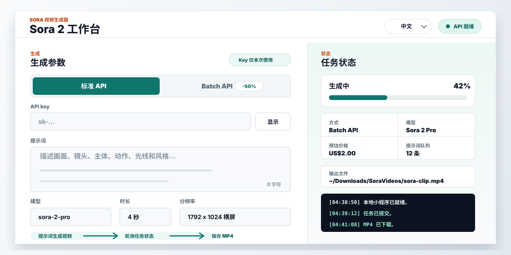

> 改造进展：Sora 已停用。当前实现支持 OpenRouter、可配置的 OpenAI 兼容视频端点，以及开发 mock（`VIDEOGEN_DEV=1`）。已移除服务端 Batch 和折扣。参见[供应商协议说明](docs/providers/openrouter.md)。
>
> 隐私变化：提示词、参数、首帧图、远端任务 ID、成本估算和输出路径现在会保存在私有 videogen 数据目录。密钥只在服务进程内存中。可用“清除历史和素材”删除已结束任务及未引用图片，已下载视频保留。阶段 0 提供记录和按远端 ID 手动找回，自动重启续跑将在持久化队列中提供。以下旧版使用说明将在下一里程碑替换。

# Sora2App

**本地优先的 OpenAI Sora 2 / Sora 2 Pro 视频工作台。**  
在浏览器里写提示词、用 Batch 排队批量生成，并自动下载完成的 MP4 —— API key 不会写入磁盘、localStorage 或日志。

[English README](./README.md)

<p align="center">
  
</p>

<p align="center">
  <a href="#快速开始"></a>
  <a href="#隐私与安全"></a>
  <a href="https://github.com/swf-cmd/videogen/blob/main/LICENSE"></a>
  
  
</p>

---

## 为什么用 Sora2App

Sora 的能力已经在 API 里了；缺的是一个安静、本地的日常工作台 —— 迭代提示词、Batch 排队、盯进度、落盘文件 —— 而且不经过第三方中转。

| | |
|---|---|
| **标准 + Batch** | 单次 Video API，或多条提示词 Batch 队列，并带内置价格估算 |
| **自动下载** | 自动轮询任务，完成后把 MP4 存到你指定的目录 |
| **首帧控制** | 可选 JPEG / PNG / WebP 参考图，必要时自动适配当前分辨率 |
| **仅本机服务** | 只监听 `127.0.0.1`，没有外部控制面 |
| **密钥不落盘** | API key 不写入磁盘、localStorage 或应用日志 |
| **多语言界面** | 中文 · 日文 · 英文 · 韩文 |

---

## 快速开始

### 方式 A — macOS 打包版

若你已有完整打包文件夹（见 [Releases](https://github.com/swf-cmd/videogen/releases)）：

```text
Start Sora2App.command
```

移动时请保持整个文件夹完整。内置 Node 运行时在 `runtime/` 下。默认端口被占用时，启动器会自动尝试后续可用端口。

### 方式 B — 从源码运行

需要 **Node.js 18+**。

```bash
git clone https://github.com/swf-cmd/videogen.git
cd videogen
npm start
```

打开终端打印的地址（默认）：

```text
http://127.0.0.1:5177
```

> 无需额外安装依赖 —— `npm start` 直接执行 `node server.js`。

---

## 使用方式

1. 填入 **OpenAI API key**
2. 选择 **标准 API** 或 **Batch API**
3. 输入提示词；Batch 模式下可用空行拆成多条
4. 选择 **`sora-2`** 或 **`sora-2-pro`**
5. 设定时长、分辨率、可选首帧图、输出目录与文件名
6. 提交 —— 应用会轮询状态，完成后自动下载 MP4

### 模型与限制

| | 说明 |
|---|---|
| **时长** | `4` · `8` · `12` · `16` · `20` 秒 |
| **sora-2** | `720×1280` · `1280×720` |
| **sora-2-pro** | `720×1280` · `1280×720` · `1024×1792` · `1792×1024` · `1080×1920` · `1920×1080` |
| **首帧图** | 可选 JPEG / PNG / WebP；尺寸不一致时会按当前分辨率自动处理 |

提交前，界面会校验模型与分辨率组合是否合法。

### Batch 模式

- 提示词按**空行**拆成队列
- **单条提示词** → 可用「提交条数」重复提交
- **多条提示词** → 提交队列前 *N* 条（最多 50,000）
- 界面会显示带约 50% Batch 折扣的价格估算；大批量前请以 [OpenAI 官方定价](https://openai.com/api/pricing/) 为准

---

## 隐私与安全

Sora2App 面向**本机使用**，不是多租户托管服务。

| 承诺 | 行为 |
|---|---|
| 监听地址 | 服务只绑定 **`127.0.0.1`** |
| API key | 仅用于当前请求 —— **不会**写入磁盘、localStorage 或日志 |
| 输出路径 | 输出目录**不会**持久化到 localStorage |
| 路径展示 | 主目录路径缩写成 `~/...`，降低截图泄露风险 |
| 请求路径 | 本机服务**直连** OpenAI —— 不经第三方代理 |

仍须知晓：提交任务时，提示词、参数、可选参考图和生成结果会发给 OpenAI。不要粘贴你不希望发给 OpenAI 的内容。

发 issue 或截图前，请遮掉 API key、完整本机路径、video / Batch ID、私密提示词，以及不想公开的视频。

完整说明：[PRIVACY.md](./PRIVACY.md) · [SECURITY.md](./SECURITY.md) · [CONTRIBUTING.md](./CONTRIBUTING.md)

**请勿把本服务暴露到公网。** 若你修改监听地址、做反向代理或远程部署，访问控制与密钥安全由你自行负责。

---

## 目录结构

```text
videogen/
├── server.js              # 本机 Node 服务（OpenAI + 文件读写）
├── public/                # Web 界面
├── Start Sora2App.command # macOS 启动器（打包版）
├── docs/                  # 预览图与发布说明
└── runtime/               # 内置 Node（仅发布包；不在 git 中）
```

---

## 发布包

源码仓库**不包含** `runtime/`（体积过大，不适合进 git 历史）。完整 macOS 包请放在 [GitHub Releases](https://github.com/swf-cmd/videogen/releases)。

建议附件：

| 资源 | 内容 |
|---|---|
| `sora2app-macos-universal.zip` | 应用文件夹 + arm64 / x64 Node 运行时 |
| `source.zip` | 仅源码，无 `runtime/` |

发布清单与推广文案：[docs/GITHUB_LAUNCH_CHECKLIST.md](./docs/GITHUB_LAUNCH_CHECKLIST.md) · [docs/PROMOTION_KIT.md](./docs/PROMOTION_KIT.md)

---

## 参与贡献

欢迎 Issue 与 PR。提交前请先搜索已有 issue，且不要粘贴 API key 或私密素材。

开发与 PR 约定见 [CONTRIBUTING.md](./CONTRIBUTING.md)。

---

## License

[MIT](./LICENSE) — 可自由使用、修改与分发。
